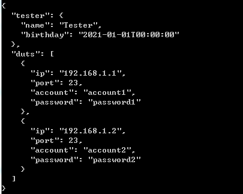
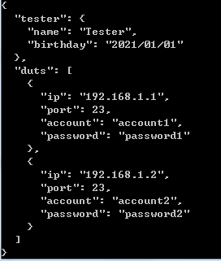

# Newtonsoft.Json 


先建立一個class object
```csharp
public class TelnetInfo{
    public string ip;
    public int port = 23;
   
    public string account;
    public string password;
} 
public class Person{
    public string name { get; set; }
    public DateTime birthday { get; set; } 
  
}

public class TestInfo{
    public Person tester = new Person();
    public List<TelnetInfo> duts = new List<TelnetInfo>();

    /*Using JsonIgnore for fields you don't want to output*/
    [JsonIgnore]
    public string boardnumber { get; set; }
} 
```

## SerializeObject

```csharp
    public static void example1(){  
        //create object
        TestInfo testInfo = new TestInfo();                   
        testInfo.tester = new Person(){
            name = "Tester",
            birthday =  DateTime.Parse("2021-01-01"),
        };        
        testInfo.duts.Add(new TelnetInfo(){ip = "192.168.1.1",account = "account1",password = "password1"});
        testInfo.duts.Add(new TelnetInfo(){ip = "192.168.1.2",account = "account2",password = "password2"});         
        string json = JsonConvert.SerializeObject(testInfo, Formatting.Indented);
        Console.WriteLine(json);         
    } 
```
結果如下<br>


可以自訂輸出日期格式

```csharp
    JsonSerializerSettings settings = new JsonSerializerSettings();                
    settings.DateFormatString = "yyyy/MM/dd";
    settings.Formatting = Formatting.Indented;
    json = JsonConvert.SerializeObject(testInfo, settings);    
    Console.WriteLine(json);       
```
結果如下<br>

輸出json

```csharp
File.WriteAllText("example1.json", json, Encoding.UTF8);       
```


## DeserializeObject


```csharp 
    TestInfo testInfo ;    
    string json= File.ReadAllText("example1.json", Encoding.UTF8); 
    testInfo = JsonConvert.DeserializeObject<TestInfo>(json); 
```


            