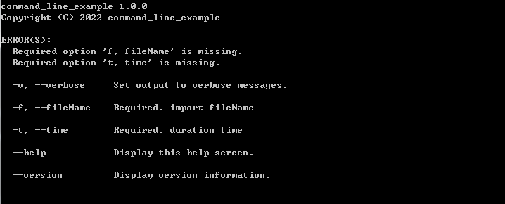

# CommandLineParser
這是一個命令解析的


## Simple Example



```csharp
using System;
using CommandLine;

namespace command_line_example
{
    class Program
    {
        //https://github.com/commandlineparser/commandline
        static void Main(string[] args)
        {
            Parser.Default.ParseArguments<Options>(args).WithParsed(Run);  
        }
       
        public  class Options
        {
            [Option('v', "verbose", Required = false, HelpText = "Set output to verbose messages.")]
            public bool Verbose { get; set; }


            [Option('f', "fileName", Required = true, HelpText = "import fileName")]
            public string fileName { get; set; }

            [Option('t', "time", Required = true, HelpText = "duration time")]

            public int time { get; set; }               
        }
        public static void Run(Options option){

            Console.WriteLine(option.fileName);
            Console.WriteLine(option.time);
            Console.WriteLine(option.Verbose);
            Console.WriteLine("use verbose");
        }      
    }
}
```

根據Options判斷
```csharp
    static void Main(string[] args)
    {        
        Parser.Default.ParseArguments<Options>(args)
               .WithParsed<Options>(o =>
               {       
                   if (o.Verbose)
                   {                          
                       Run(o);
                   }
                   else
                   {
                        Run2(o);
                   }
               });
 
    }
    ...
    public static void Run2(Options option){

        Console.WriteLine(option.fileName);
        Console.WriteLine(option.time);
        Console.WriteLine("not use verbose");       
    }
    
```

## Multiple Verb

有時候不同動作需要不同的Option,可以使用verb屬性來區格
```csharp
        [Verb("add", HelpText = "Add file contents to the index.")]
        class AddOptions {
            [Option('f', "file", Required = true, HelpText = "Add file")]
            public string file { get; set; }    
        }
        
        [Verb("commit", HelpText = "Record changes to the repository.")]
        class CommitOptions { 
            [Option('f', "file", Required = true, HelpText = "Add file")]
            public string file { get; set; }             
        }
        
        [Verb("clone", HelpText = "Clone a repository into a new directory.")]
        class CloneOptions { 
            [Option('o', "outfile", Required = true, HelpText = "clone location")]
            public string outfile { get; set; }              
        }     
```
顯示效果如下


如果輸入 add 指令


如何實際執行

```csharp
    Parser.Default.ParseArguments<AddOptions, CommitOptions, CloneOptions>(args)
    .WithParsed<AddOptions>(options => AddAction(options))
    .WithParsed<CommitOptions>(options => CommitAction(options))
    .WithParsed<CloneOptions>(options => CloneAction(options))
    .WithNotParsed(errors => ErrorAction(options));
    
```
 
如果需要回傳error code可以使用
 
```csharp
 var exitCode = Parser.Default.ParseArguments<AddOptions, CommitOptions, CloneOptions>(args)
    .MapResult(
      (AddOptions options) => RunAddAndReturnExitCode(opts),
      (CommitOptions options) => RunCommitAndReturnExitCode(opts),
      (CloneOptions options) => RunCloneAndReturnExitCode(opts),
      errors => 1);
      
```

最終的code
```csharp
using System;
using CommandLine;
namespace command_line_example
{
    class Program
    {
        
        [Verb("add", HelpText = "Add file contents to the index.")]
        class AddOptions {
            [Option('f', "file", Required = true, HelpText = "Add file")]
            public string file { get; set; }    
        }
        
        [Verb("commit", HelpText = "Record changes to the repository.")]
        class CommitOptions { 
            [Option('f', "file", Required = true, HelpText = "Add file")]
            public string file { get; set; }             
        }
        
        [Verb("clone", HelpText = "Clone a repository into a new directory.")]
        class CloneOptions { 
            [Option('o', "outfile", Required = true, HelpText = "clone location")]
            public string outfile { get; set; }              
        }              
        
        static void Main(string[] args)
        {
            Parser.Default.ParseArguments<AddOptions, CommitOptions, CloneOptions>(args)
            .WithParsed<AddOptions>(options => AddAction(options))
            .WithParsed<CommitOptions>(options => CommitAction(options))
            .WithParsed<CloneOptions>(options => CloneAction(options))
            .WithNotParsed(errors => ErrorAction());

        }

        static void AddAction(AddOptions option){
            Console.WriteLine("AddAction");          
        }
        static void CommitAction(CommitOptions option){
            Console.WriteLine("CommitAction");          
        }      
        static void CloneAction(CloneOptions option){
            Console.WriteLine("CloneAction");          
        }    
         static void ErrorAction(){
            Console.WriteLine("Error");          
        }  
        
    
    }
}

```


